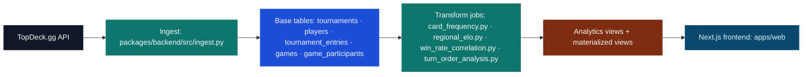
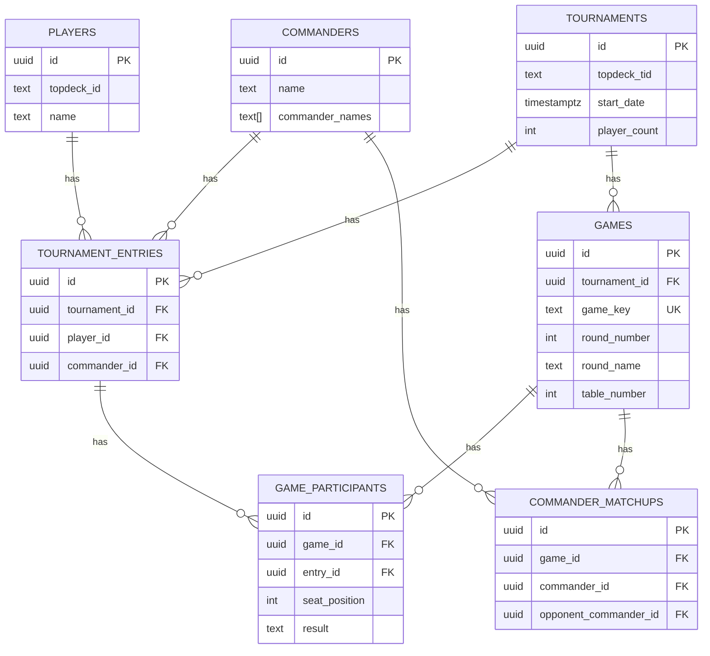

# Data Model (Supabase Schema)

## Internal Elo model publication

`internal_elo_model_runs` records the model version, source cutoff, full-precision
parameters, output counts, and publication timestamp. It is service-only and is
written atomically with the five derived Elo tables. Raw top-cut draws remain in
source tables; internal Elo events resolve them to modeled wins/losses. See
[ADR 0021](../decisions/0021-tuned-internal-elo.md) for the model and safeguards.
Displayed Elo continues to use TopDeck values.

This document summarizes the Supabase schema used to power cEDH Analytics, including core tables and curated analytical views.

## Source of Truth

- Primary schema definitions live in Supabase migrations under `packages/backend/supabase/migrations`.
- A summarized data dictionary is maintained in `packages/backend/docs/data_dictionary.md`.

## ETL Flow

## Data Model (ERD)

## Core Entities

## Identity And Idempotency

- Every major base row has its own UUID primary key: `players.id`, `tournaments.id`, `tournament_entries.id`, `games.id`, and `game_participants.id`.
- UUIDs identify stored rows, not logical dedupe boundaries.
- Logical game idempotency is enforced by `games.game_key`, a deterministic key built from `tournament_id`, round identity, table number, and bracket flag.
- `game_participants` hangs off `games.id`, so duplicate logical games will fan out directly into duplicated participant rows and downstream analytics unless `game_key` is canonical and unique.

### Tournaments

- `tournaments`: TopDeck.gg events (location, dates, player_count, rounds, top_cut, `is_league`).

### Players

- `players`: TopDeck.gg player identities (name, topdeck_id).

### Commanders

- `commanders`: Commander or partner combinations (name, color_identity, scryfall_ids).

### Participation

- `tournament_entries`: One player’s entry in one tournament (wins/losses/draws, standings, points, decklist).

### Games

- `games`: Individual pod games within a tournament round.
- `game_participants`: One player’s seat and result in a game.

### Matchups

- `commander_matchups`: Commander-vs-commander outcomes per game.

## Curated Views (Analytics)

### Commander Performance

- `commander_stats`: Aggregate entries, win rate, and top cut conversion. Filtered to 32+ player events.
- `commander_seat_stats`: Commander performance split by seat position.

### Trends

- `commander_weekly_trends`: Weekly commander aggregates.
- `commander_monthly_trends`: Monthly commander aggregates.
- `commander_wow_mom`: Latest week-over-week and month-over-month deltas.

### Card Analytics

- `card_frequencies_by_commander`: Card inclusion rates per commander.
- `card_frequencies_global`: Global card inclusion rates.
- `card_performance_by_commander`: Card performance by commander.
- `card_performance_global`: Global card performance.

### Tournament Journeys

- `player_tournament_journey`: Round-by-round progression for each player.
- `pod_composition`: Full pod lineups with seat and result.
- `player_seat_distribution`: Seat distribution and win rate by player.

### Global Elo

- `global_elo_ratings`: Global per-player rating state.
- `global_elo_leaderboard`: Global leaderboard view with country/state filter rows derived from global ratings.
- `global_elo_regions`: Region availability and update metadata.
- `global_elo_game_results`: Base view for global Elo calculations.

### Meta Preparation

- `player_commander_entries`: Player’s commander history per tournament for fast meta scans.

## Conventions

- Analytics generally filter to tournaments with `player_count >= 32`.
- Partner commanders are stored as a single combined commander entity.
- “Unknown Commander” entries can appear when deck data is missing and are typically filtered from analytics.
- Some TopDeck league-style events only expose standings-level rates (`successRate`, `opponentSuccessRate`) and no pod rounds. Those events should be treated as standings-only, not pod-level analytics inputs.

## Frontend Consumption

The Next.js app reads from Supabase views for most pages to keep the anon role safe:

- Rankings: `commander_stats`, `commander_weekly_trends`, `commander_monthly_trends`
- Card analytics: `card_frequencies_*`, `card_performance_*`
- Global Elo: `global_elo_leaderboard`, `global_elo_regions`
- Meta prep: `player_commander_entries`

If a view is missing, the corresponding page will show empty state messaging.

### League backfill and commander prediction shares

Recent ingestion searches 45 days, includes leagues, and applies no minimum
player count by default. This covers typical monthly leagues plus a short
finals period, but does not guarantee coverage of finals played months later.
Refresh known older events with `--tournament-id` or a `--tids-file` manifest.
A follow-up to track and refresh unfinished leagues independently of their
start dates remains necessary before calling this an exhaustive late-final sweep.

An explicit boolean `isLeague` survives the API/Firestore fallback. Missing or
null flags do not overwrite an existing tournament classification.

Commander forecasts blend 75% of normalized recency weight with 25% assigned to
the latest commander. `prediction_share` and `model_share` both expose the
normalized blended probability; `weighted_share` retains the unblended value.
Only the top three rows are persisted, so their shares can sum to less than one
when more commanders qualify. The active commander score is its blended share.

## Canonical location and commander names

See [ADR 0015](../decisions/0015-canonical-region-and-commander-names.md).
The cleanup adds `region_name_aliases`, `commander_name_aliases`, and
`commander_pair_display_order`. Exact country-aware location aliases persist full
region names. Reviewed event corrections retain source-address guards. Commander
aliases share canonical identities, front faces, and saved pair display order.
Run `consolidate_names.py` for transactional source repair and derived refresh.
