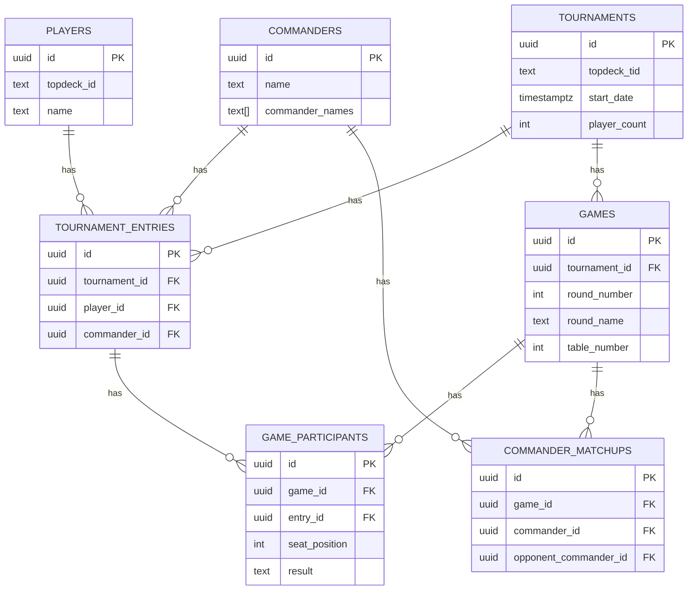

# Data Dictionary

Last reviewed: 2026-02-28
Update policy: This file must be updated whenever migrations in `packages/backend/supabase/migrations` change.

This describes the primary tables and analytical views used in the cEDH Analytics database.

## ERD (Core Tables)

## Key Concepts

- **Entry**: one player's participation in one tournament (one row in `tournament_entries`, keyed by `tournament_id + player_id`).
- **Tournament**: a TopDeck.gg event (`tournaments`).
- **Game**: a single pod game within a tournament round (`games`).

## Core Tables

### `commanders`
- **Purpose**: unique commander (or partner) combinations.
- **Key fields**:
  - `id`: UUID
  - `name`: display name (e.g., "Kraum, Ludevic's Opus / Tymna the Weaver")
  - `commander_names`: array of individual commander names
  - `scryfall_ids`: optional Scryfall card IDs
  - `color_identity`, `archetype`, `win_condition`, `notes`

### `players`
- **Purpose**: unique TopDeck.gg players.
- **Key fields**:
  - `id`: UUID
  - `topdeck_id`: TopDeck.gg player UID (unique)
  - `name`: display name (can change)

### `tournaments`
- **Purpose**: TopDeck.gg tournament events.
- **Key fields**:
  - `id`: UUID
  - `topdeck_tid`: TopDeck.gg tournament ID/slug (unique)
  - `name`, `start_date`, `end_date`
  - `player_count`, `swiss_rounds`, `top_cut`
  - location fields (`city`, `state`, `country`, `venue`, `latitude`, `longitude`)

### `tournament_entries`
- **Purpose**: a player's tournament participation and results.
- **Key fields**:
  - `tournament_id`, `player_id`, `commander_id`
  - `final_standing`, `points`
  - `wins`, `losses`, `draws`, `byes`
  - `wins_swiss`, `losses_swiss`, `wins_bracket`, `losses_bracket`
  - `win_rate`, `opponent_win_rate`
  - `decklist_url`, `decklist_text`, `decklist_obj`
  - `made_top_cut`, `made_top_16` (Top 4 for tournaments with 34 or fewer players)

### `games`
- **Purpose**: individual pod games within a round.
- **Key fields**:
  - `tournament_id`, `round_number`, `round_name`, `is_bracket`, `table_number`
  - `status`, `is_draw`, `winner_id`
  - `game_key`: deterministic key for idempotent upserts

### `game_participants`
- **Purpose**: each player's seat and result in a game.
- **Key fields**:
  - `game_id`, `entry_id`, `seat_position`
  - `result` (`win`/`loss`/`draw`/`bye`)
  - `points_earned`

### `commander_matchups`
- **Purpose**: per-game commander vs commander outcomes.
- **Key fields**:
  - `game_id`, `commander_id`, `opponent_commander_id`
  - `won_against`, `commander_seat`, `opponent_seat`
  - `tournament_id`, `round_number`

## Analytical Views

### `commander_stats` (view)
- **Purpose**: commander performance summary with win rates and conversion rates.
- **Filters**: only tournaments with `player_count >= 32`.

### `commander_stats_large` (view)
- **Purpose**: commander performance summary for large events.
- **Filters**: only tournaments with `player_count >= 65`; excludes `Unknown Commander`.

### `seat_position_stats` (view)
- **Purpose**: win rate by seat position across all games.

### `player_tournament_journey` (view)
- **Purpose**: per-player round-by-round journey through a tournament.

### `pod_composition` (view)
- **Purpose**: pod lineup for each game (player, commander, seat, result).

### `player_seat_distribution` (view)
- **Purpose**: distribution and win rate by seat for each player.

### `commander_seat_stats` (materialized view)
- **Purpose**: commander performance split by seat position.

### Trend Views (materialized + view)
- **`commander_weekly_trends`**: per-commander weekly aggregates. Includes `week_start_date` and `week_key`.
- **`commander_monthly_trends`**: per-commander monthly aggregates. Includes `month_start_date` and `month_key`.
- **`commander_wow_mom`** (view): latest week/month deltas in entries (%) and win rate (percentage points).
- **`commander_weekly_trends_large`** (materialized): weekly aggregates for events with `player_count >= 65`.
- **`commander_monthly_trends_large`** (materialized): monthly aggregates for events with `player_count >= 65`.

### Top-Cut KPI Views
- **`commander_top_cut_kpis`**: per-commander Top 4/Top 10/Top 16 appearance share, conversion, and event-win rates using normalized brackets.
- **`archetype_top_cut_kpis`**: same Top 4/Top 10/Top 16 KPI framework aggregated by archetype.

### Card Analytics (materialized views)
- **`card_frequencies_by_commander`**: per-commander card inclusion frequencies.
- **`card_frequencies_global`**: overall card inclusion frequencies.
- **`card_performance_by_commander`**: win rate correlation per commander.
- **`card_performance_global`**: global card performance.

## Notes / Conventions

- **Competitive filter**: most analytics use tournaments with `player_count >= 32`.
- **Top-cut normalization**: analytics that compare small and large events use normalized brackets:
  - `17-34` players => Top 4
  - `35-64` players => Top 10
  - `65+` players => Top 16
- **Unknown commanders**: some queries exclude `commander_name = 'Unknown Commander'`.
- **Win rate**: computed as `wins / (wins + losses + draws)`; if total results are 0, win rate is `NULL`.
