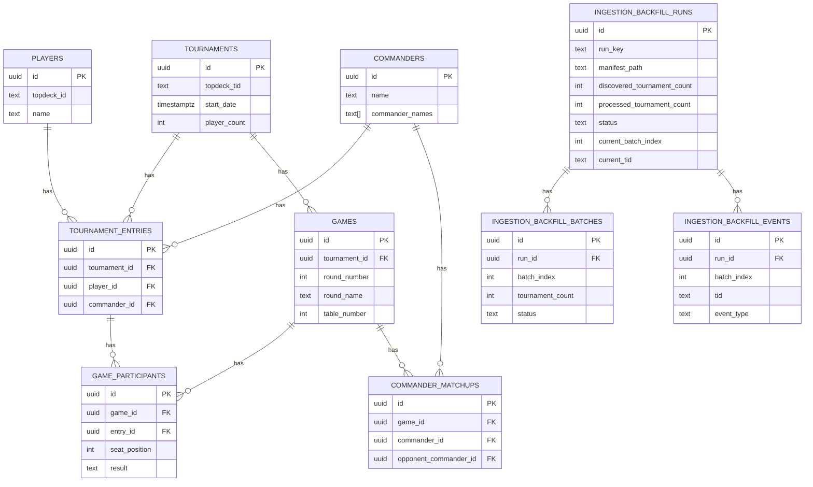

# Data Dictionary

Last reviewed: 2026-04-09
Update policy: This file must be updated whenever migrations in `packages/backend/supabase/migrations` change.

This describes the primary tables and analytical views used in the cEDH Analytics database.

## ERD (Core Tables)

## Key Concepts

- **Entry**: one player's participation in one tournament (one row in `tournament_entries`, keyed by `tournament_id + player_id`).
- **Tournament**: a TopDeck.gg event (`tournaments`).
- **Game**: a single pod game within a tournament round (`games`).

## Core Tables

### `commanders`
- **Purpose**: unique commander (or partner) combinations.
- **Key fields**:
  - `id`: UUID
  - `name`: display name (e.g., "Kraum, Ludevic's Opus / Tymna the Weaver")
  - `commander_names`: array of individual commander names
  - `scryfall_ids`: optional Scryfall card IDs
  - `color_identity`, `archetype`, `win_condition`, `notes`

### `players`
- **Purpose**: unique TopDeck.gg players.
- **Key fields**:
  - `id`: UUID
  - `topdeck_id`: TopDeck.gg player UID (unique)
  - `name`: display name (can change)

### `tournaments`
- **Purpose**: TopDeck.gg tournament events.
- **Key fields**:
  - `id`: UUID
  - `topdeck_tid`: TopDeck.gg tournament ID/slug (unique)
  - `name`, `start_date`, `end_date`
  - `player_count`, `swiss_rounds`, `top_cut`
  - location fields (`city`, `state`, `country`, `venue`, `latitude`, `longitude`)

### `tournament_entries`
- **Purpose**: a player's tournament participation and results.
- **Key fields**:
  - `tournament_id`, `player_id`, `commander_id`
  - `final_standing`, `points`
  - `wins`, `losses`, `draws`, `byes`
  - `wins_swiss`, `losses_swiss`, `wins_bracket`, `losses_bracket`
  - `win_rate`, `opponent_win_rate`
  - `decklist_url`, `decklist_text`, `decklist_obj`
  - `made_top_cut`, `made_top_16` (Top 4 for tournaments with 34 or fewer players)
- **TopDeck note**:
  - league-style standings may expose `successRate` / `opponentSuccessRate` instead of `winRate` / `opponentWinRate`
  - ingestion should normalize those source fields into `win_rate` / `opponent_win_rate`

### `games`
- **Purpose**: individual pod games within a round.
- **Key fields**:
  - `tournament_id`, `round_number`, `round_name`, `is_bracket`, `table_number`
  - `status`, `is_draw`, `winner_id`
  - `game_key`: deterministic key for idempotent upserts
- **TopDeck note**:
  - some league-style events return no `rounds`; those events should be treated as standings-only rather than as missing pod-data failures

### `game_participants`
- **Purpose**: each player's seat and result in a game.
- **Key fields**:
  - `game_id`, `entry_id`, `seat_position`
  - `result` (`win`/`loss`/`draw`/`bye`)
  - `points_earned`
- **Notes**:
  - `seat_position` is constrained to `>= 0`; historical backfills may contain pods larger than four seats.

### `commander_matchups`
- **Purpose**: per-game commander vs commander outcomes.
- **Key fields**:
  - `game_id`, `commander_id`, `opponent_commander_id`
  - `won_against`, `commander_seat`, `opponent_seat`
  - `tournament_id`, `round_number`

### `global_elo_ratings`
- **Purpose**: persisted Elo-style ratings. Current production intent is one global row per player keyed as `('global', 'ALL')`; state leaderboards are derived from assigned-state activity rather than separate state rating pools.
- **Key fields**:
  - `region_type`, `region_key`, `player_id`
  - `rating`, `games_played`, `wins`, `draws`, `losses`
  - `last_game_date`, `updated_at`
- **Security**:
  - row level security is enabled
  - public read access is allowed through a SELECT policy

### `global_elo_state_activity`
- **Purpose**: per-player state activity snapshots used to assign each player to one primary state.
- **Key fields**:
  - `region_type`, `region_key`, `country_key`, `player_id`
  - `games_30d`, `games_90d`, `games_365d`, `games_lifetime`
  - `wins`, `draws`, `losses`, `last_game_date`
  - `activity_score`, `is_primary_state`, `updated_at`

### `global_elo_game_events`
- **Purpose**: persisted per-game Elo deltas for the global Elo stream.
- **Key fields**:
  - `region_type`, `region_key`, `game_id`, `player_id`
  - `expected_score`, `actual_score`
  - `rating_before`, `rating_delta`, `rating_after`

### `global_elo_active_leaderboard`
- **Purpose**: precomputed six-month-active leaderboard slices for fast Global Elo and profile rank reads.
- **Key fields**:
  - `region_type`, `region_key`, `country_key`, `rank`
  - `player_id`, `player_name`, `topdeck_id`
  - `rating`, `games_played`, `wins`, `draws`, `losses`, `last_game_date`
  - `primary_country_key`, `primary_region_key`, `activity_score`, `updated_at`

### `global_elo_player_profile_summaries`
- **Purpose**: compact per-player Global Elo/profile summary populated by the backend recompute job.
- **Key fields**:
  - `player_id`, `topdeck_id`, `player_name`
  - `games_played`, `wins`, `draws`, `losses`, `last_game_date`
  - `home_country_key`, `home_region_key`, `state_assignments`, `updated_at`

### `player_commander_profiles`
- **Purpose**: compact per-player commander forecast snapshot populated by the weekly backend job for fast leaderboard, drilldown, and Tournament Prep reads.
- **Key fields**:
  - `player_id`, `topdeck_id`, `player_name`
  - `active_commander`, `active_commander_entries`, `active_commander_prediction_score`
  - `total_entries`, `commander_predictions`
  - `latest_commander`, `latest_commander_date`, `latest_decklist_url`, `updated_at`

### `elo_maintenance_jobs`
- **Purpose**: queue and observability log for scheduled Global Elo maintenance runs.
- **Key fields**:
  - `id`, `status`, `trigger_source`, `github_run_id`
  - `created_at`, `dispatched_at`, `started_at`, `completed_at`, `heartbeat_at`
  - `ratings_count`, `state_activity_count`, `game_events_count`
  - `leaderboard_count`, `profile_count`, `commander_profile_count`
  - `duration_seconds`, `error_text`
- **Status values**:
  - `pending`, `dispatched`, `running`, `completed`, `failed`, `stale`
- **Security**:
  - row level security is enabled
  - public read access is allowed through a SELECT policy
  - writes are restricted to the service role and `SECURITY DEFINER` database functions

### `ingestion_backfill_runs`
- **Purpose**: operational log for historical backfill runs driven from stable TID manifests.
- **Key fields**:
  - `run_key`, `manifest_path`, `manifest_sha256`
  - `batch_size`, `total_batches`
  - `discovered_tournament_count`, `processed_tournament_count`, `succeeded_tournament_count`, `failed_tournament_count`
  - `requested_start_date`, `requested_end_date`, `status`
  - `current_batch_index`, `current_tid`, `last_completed_tid`
  - `current_batch_processed_count`, `current_batch_succeeded_count`, `current_batch_failed_count`
  - `last_success_at`, `heartbeat_at`

### `ingestion_backfill_batches`
- **Purpose**: per-batch progress and failure tracking for a historical backfill run.
- **Key fields**:
  - `run_id`, `batch_index`
  - `batch_start`, `batch_end`, `tournament_count`
  - `status`, `error_text`, `started_at`, `finished_at`

### `ingestion_backfill_events`
- **Purpose**: append-only event stream for backfill execution, used for per-tournament telemetry and debugging.
- **Key fields**:
  - `run_id`, `batch_index`, `tid`
  - `event_type`
  - `payload`, `created_at`
- **Event types**:
  - `batch_started`, `batch_completed`, `batch_failed`
  - `fetch_started`, `fetch_failed`
  - `process_started`, `process_succeeded`, `process_failed`
  - `tournament_skipped`

## Migration 20260408000000_security_hardening_part2
- **Purpose**: lock down the remaining public-facing regional Elo and ingestion tables while keeping the public leaderboard view accessible through the service role.
- **Key actions**:
  - Enables Row-Level Security and service-role-only policies on `regional_elo_game_events`, `ingestion_backfill_batches`, `ingestion_backfill_runs`, and `ingestion_backfill_events`.
  - Provides `public.is_service_role()` as the shared predicate for all restricted objects.
  - Converts the regional Elo leaderboard/region/canonical views into `SECURITY INVOKER` forms and revokes `anon/authenticated` grants, while keeping `regional_elo_state_activity` readable via a dedicated policy.

## Analytical Views

### `commander_stats` (view)
- **Purpose**: commander performance summary with win rates and conversion rates.
- **Filters**: only tournaments with `player_count >= 32`.

### `player_tournament_journey` (view)
- **Purpose**: per-player round-by-round journey through a tournament.

### `pod_composition` (view)
- **Purpose**: pod lineup for each game (player, commander, seat, result).

### `player_seat_distribution` (view)
- **Purpose**: distribution and win rate by seat for each player.

### `player_commander_entries` (view)
- **Purpose**: normalized player commander history for meta prep and tournament likelihood tools.
- **Source tables**: `tournament_entries`, `players`, `commanders`, `tournaments`.
- **Key fields**:
  - `player_id`, `topdeck_id`, `player_name`
  - `commander_id`, `commander_name`
  - `start_date`, `state`, `country`
  - `wins`, `losses`, `draws`
  - `decklist_url`: decklist link or stored TopDeck decklist payload from the tournament entry.

### Trend Views (materialized + view)
- **`commander_weekly_trends`**: per-commander weekly aggregates. Includes `week_start_date` and `week_key`.
- **`commander_monthly_trends`**: per-commander monthly aggregates. Includes `month_start_date` and `month_key`.
- **`commander_wow_mom`** (view): latest week/month deltas in entries (%) and win rate (percentage points).

### Global Elo And Region Views
- **`global_elo_game_results`**: denormalized game-level input rows used to compute the global Elo stream and state activity from games, entries, players, and tournaments with location data.
- **`global_elo_game_event_log`**: global Elo per-game event log enriched with tournament, player, commander, and seat context.
- **`global_elo_primary_state_assignments`**: one row per player for the state currently assigned from recency-weighted activity.
- **`global_elo_player_stats`**: canonical assigned-state game counts and W/L/D totals sourced from `global_elo_primary_state_assignments`.
- **`global_elo_leaderboard`**: global, country, and assigned-state leaderboard rows by `region_type` and `region_key`, enriched with player names and TopDeck IDs. Rankings use global Elo. Displayed games, wins, draws, losses, and last-game date are sourced from canonical `global_elo_game_events` aggregates for the player's global `('global', 'ALL')` stream rather than from rating-table counters, so unknown-region games remain counted and stale rating counters do not leak into the leaderboard.
- **`global_elo_regions`**: global, country, and assigned-state region summary with player counts, country grouping, and latest `updated_at` timestamp.

## Migration 20260409140000_fix_global_leaderboard_canonical_counts
- **Purpose**: make leaderboard/profile-facing global counts use canonical game-event aggregates instead of historical counters persisted on the rating rows.
- **Key actions**:
  - Rebuilds `regional_elo_leaderboard` from `global_elo_ratings` joined to aggregated `global_elo_game_events` counts for the global `ALL` stream.
  - Keeps global/country/state leaderboard ranking based on rating plus the existing activity/order tie-breaks, while replacing displayed record fields with canonical aggregate values.
  - Recreates `global_elo_leaderboard` as an alias of the updated `regional_elo_leaderboard` and reapplies `security_invoker` plus public `SELECT` grants.

### Card Analytics (materialized views)
- **`card_frequencies_by_commander`**: per-commander card inclusion frequencies.
- **`card_frequencies_global`**: overall card inclusion frequencies.
- **`card_performance_by_commander`**: win rate correlation per commander.
- **`card_performance_global`**: global card performance.

## Notes / Conventions

- **Competitive filter**: most analytics use tournaments with `player_count >= 32`.
- **Discovery caveat**: `data/all_time_tids.txt` is a stable replay manifest, not a guaranteed source of all discoverable TopDeck tournaments. Known misses should be curated into supplemental manifests.
- **Unknown commanders**: some queries exclude `commander_name = 'Unknown Commander'`.
- **Win rate**: computed as `wins / (wins + losses + draws)`; if total results are 0, win rate is `NULL`.
- **Retired surfaces (checkpoint)**: standalone Cards, Turn Order, and Survival pages are being removed; page-specific SQL helpers for those surfaces should not be treated as active product contracts.
- **Security hardening (2026-03-29)**: exposed `public` views are configured to run with `security_invoker`, and `public` functions pin `search_path` to `public, extensions` to satisfy Supabase Advisor requirements.
